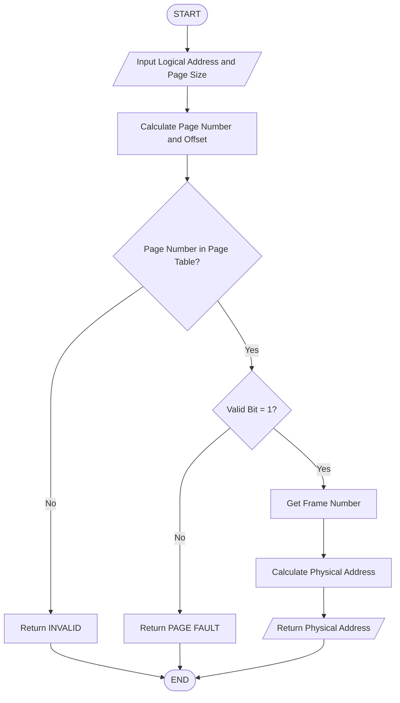

# FLOWCHART - PAGING ADDRESS TRANSLATION

```mermaid
flowchart TD
    A([START]) --> B[/Input Logical Address and Page Size/]
    B --> C[Calculate Page Number and Offset]
    C --> D{Page Number in Page Table?}
    D -- No --> E[Return INVALID]
    D -- Yes --> F{Valid Bit = 1?}
    F -- No --> G[Return PAGE FAULT]
    F -- Yes --> H[Get Frame Number]
    H --> I[Calculate Physical Address]
    I --> J[/Return Physical Address/]
    E --> K([END])
    G --> K
    J --> K
```